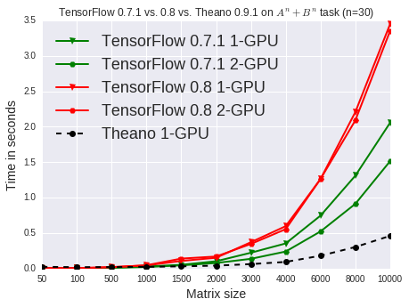

Image classification using Theano
=================================

Implement several neural networks for image classification task on MNIST dataset

|  Models                       | Accuracy  |  Notes                       |   
|-------------------------------|-----------|------------------------------|
| Softmax classifier            |  92.52%   | 784 -> 10; SGD               |
| 1-hidden layer                |  93.33%   | 784 -> 625 -> 10; SGD        |
| 2-hidden layer                |  98.72%   | 784 -> 625 -> 625-> 10;<ul><li> RMSProp</li><li>ReLU</li><li>Dropout</li></ul> |
| Convolutional Neural Network  |  99.2%    | <ul><li>a layer = convolution -> rectify -> max pooling -> dropout</li><li>layer1 -> layer2 -> layer3 -> rectify-> dropout ->softmax</li></ul>|
| Current best system           |  99.77%   | [Ciresan et al. CVPR 2012](http://arxiv.org/abs/1202.2745)        |

Text understanding with doc2vec
================================

Microsoft (and many public companies) releases earning calls every quarter. 
One obivous question is what we learn from these meetings. 
Some fun example from MSFT dataset
+ Dell - Windows + iOS = Apple
+ Apple - iOS + Windows = Microsoft
+ Microsoft - Surface + iPad = Apple
+ iPad - iOS + Windows = PCs
+ Microsoft - Windows + Android = Google

TensorFlow
=====================

